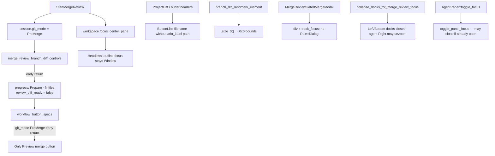
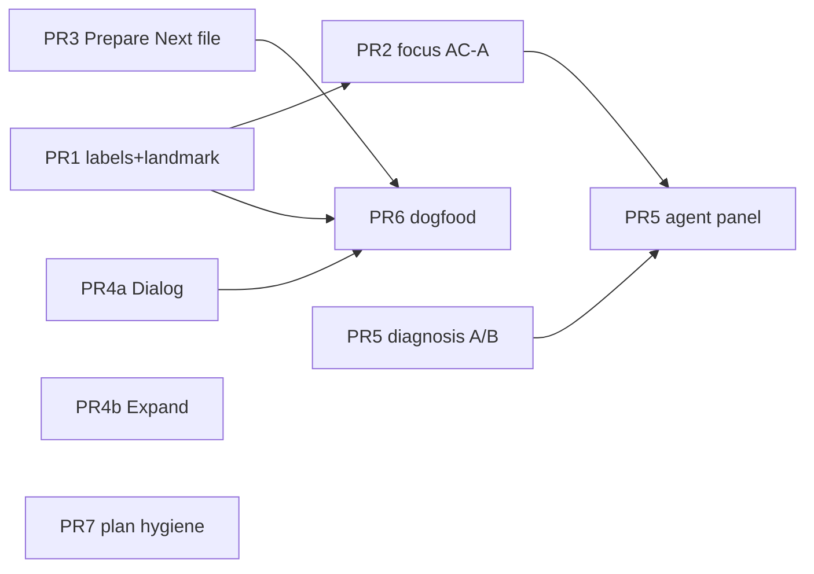

# Merge-Review / Agent-Stdio UX & A11y (Dogfood TOON)

| Field | Value |
|-------|--------|
| **Author** | Surmount design (agent-drafted) |
| **Date** | 2026-07-12 |
| **Status** | Draft (revision 3 — re-review Advance delta + minors) |
| **Related** | Plan 0 (`plans/0_agentic_dogfooding.md`), R1 closed, R2 expand |
| **Evidence** | Live queue probe 27/27 steps (`tooling/xtask/dogfood_queues/merge_review_ux.queue`) |
| **Review** | `plans/finished/merge_review_ux_a11y_review-c4e8a1f2.md` |
| **Summary** | `plans/finished/merge_review_ux_a11y_summary-c4e8a1f2.md` |

---

## Overview

Live TOON inhabit of merge review (Start → Next file → agent ToggleFocus → Preview → End) proves the **workshop path is green** (R1) and the **queue runner is real**, but the **product chrome is not yet agent-selectable**. Room outlines show focus stuck on the root `[Window]`, Branch Diff file rows as naked `[Button]` with no path labels, Prepare rail limited to Preview merge + End (no Next file / Review Diff labels), Branch Diff landmark at `0x0`, Preview modal buttons without a `[Dialog]` landmark, Expand controls at negative Y, and agent-panel landmarks missing after `agent::ToggleFocus` while merge review is active.

This design expands Plan 0 **R2** from a thin “optional Advance step” into a **product a11y + focus + step-rail honesty** program, with dogfood asserts layered on top once labels exist. Conflict fixture work remains **R3**. All fixes stay native Rust/GPUI; dogfood remains `cargo xtask dogfood` (queue / merge-review), not shell drivers.

---

## Background & Motivation

### Current state (working)

| Capability | Location | Status |
|------------|----------|--------|
| Start → Preview → End workshop | `tooling/xtask/src/tasks/dogfood.rs` `run_merge_review*` | R1 green |
| Queue runner | `dogfood queue` + `--script` | Landed (archive) |
| UX probe fixture | `tooling/xtask/dogfood_queues/merge_review_ux.queue` | 27/27 steps ran |
| Settle rule | post-open **look (force-draw)** before `StartMergeReview` | Proven (Start no-ops without paint) |
| Rail constants + paint tests | `merge_review_step_rail.rs` (`RAIL_BTN_*`, room outline tests) | Unit-tested; PreMerge = Preview only |
| Branch Diff heading helper | `branch_diff_landmark_element()` | Exists; zero-size by design |

### Pain points (live TOON)

| Severity | Issue | Evidence (room look) |
|----------|--------|----------------------|
| **High** | Focus never leaves root Window | Every look: `# focus: [Window] "zed"` |
| **High** | No “Review Diff” / “Next file →” on Prepare rail | Only Preview merge + End; step-1 “click a file” not labeled chrome |
| **High** | Branch Diff file rows unlabeled | Naked `[Button]` — no path for click/expect |
| **High** | `MergeReviewNextFile` doesn’t advance usable chrome | Still Prepare · N; no Review Diff; Open File moves without path labels |
| **Medium** | Branch Diff landmark zero-size | `[Heading] "Branch Diff" @0,580 0x0` |
| **Medium** | Agent panel invisible after ToggleFocus | No TextInput/Agent/Thread hits; sometimes second untitled window |
| **Medium** | Preview modal no Dialog landmark | Cancel/Copy/Run merge buttons exist; no `[Dialog]` |
| **Medium** | Expand control off-screen | `"Expand" @1142,-125` negative Y |
| **Low** | `inventory` `active_window: (none)` while windows exist | Headless focus bag incomplete |
| **Env** | fish+neofetch → ARG_MAX; status “Failed to load environment” | Local dogfood noise |

### Root causes (code)



1. **PreMerge is intentional product mode** — before `git merge`, the rail is *prepare + preview*, not per-file review. `merge_review_branch_diff_controls` (≈5146–5150) sets `review_diff_ready = false` and returns; `workflow_button_specs` (≈299–311) returns only `RAIL_BTN_PREVIEW_MERGE`. Unit tests **forbid** Next file / Review Diff in PreMerge today — PR3 rewrites those tests deliberately.
2. **File path is visual-only** — `render_buffer_header` (`editor/src/element/header.rs`) paints filename `Label` inside `ButtonLike::new("filename-button")` and tooltip meta `full_path`, but outline often exposes unlabeled `[Button]` / “Open File” without path as `aria_label`.
3. **Landmark is size-zero** — `branch_diff_landmark_element` uses `.size_0().overflow_hidden()` so it never competes with interactive focus, but room outline reports `0x0`.
4. **Focus after actions** — Start / NextFile call `focus_center_pane` / activate ProjectDiff; headless AccessKit focus line still reports Window. No post-action focus to rail primary or first labeled file control.
5. **Preview modal** — `MergeReviewGatedMergeModal::render` is a focused `div` without `Role::Dialog` / dialog name.
6. **Agent panel during merge review** — `ensure_merge_review_focus_layout` calls `prepare_for_merge_review`, `unzoom_agent_dock_for_merge_review`, and `collapse_docks_for_merge_review_focus` (Left + Bottom only — **not** Right agent dock). `AgentPanel::toggle_focus` uses `workspace.toggle_panel_focus` (can **close** the panel if already open) and has no merge-review special case except grok immersive short-circuit. Composer landmarks live in thread/composer children, not `AgentPanel` root roles. Live gap may be: dock closed, toggle closed it, thread not ready, second window, or child a11y missing — **diagnose before coding** (see PR5).

---

## Goals & Non-Goals

### Goals

1. **Agent-selectable chrome** for merge-review inhabit: labeled file rows, assertable rail steps, Dialog landmark on Preview, non-zero Branch Diff place marker.
2. **Product focus** after Start / NextFile / Preview to a named control (rail / path / Dialog); outline `# focus:` non-Window is **stretch** if headless bag lags.
3. **Honest Prepare UX**: PreMerge surfaces labeled **Next file →** (available) + **Preview merge** (primary); never Review Diff until MergeInProgress.
4. **Agent panel room landmarks** after ToggleFocus while merge-review session is active (no OS–agent coupling) — after diagnosis.
5. **Dogfood**: settle look-before-Start; **AND** `expect:` asserts (not OR-only `hit:`); optional `--with-advance` once labels exist.
6. **Plan 0 residual** already tracks R2; PR7 is post-merge hygiene only.

### Non-Goals

- Full per-file ACP review loop or conflict Decide path in dogfood (**R3**).
- Shell/Python drivers; inventing paint/CSS from outline.
- Whole-tree outline caps or fatter TOON fields (W3 closed).
- Full macOS/Windows headless a11y golden (Linux-primary paint; methods stay OS-agnostic).
- Fixing fish/neofetch ARG_MAX as a product requirement (skill noise note only).
- Requiring outline `# focus:` leave Window if GPUI headless cannot (product focus still required).
- Default `merge-review` adventure requiring Dialog or `--with-advance`.

---

## Proposed Design

### Design principles

1. **Prefer role/label a11y over inventing outline paint** — set `aria_label` / `Role` on existing elements; keep visual design.
2. **PreMerge vs MergeInProgress stays real** — do not fake Review Diff readiness before git merge; make Prepare **legible** and file selection **clickable by path**.
3. **Focus follows primary control** after workflow actions (product focus_handle required; outline focus line stretch).
4. **Dogfood hard-fails use `expect:` (AND)** — `hit:` is diagnostic print-only (OR needles); never use a single OR `hit:` as a gate.
5. **Native GPUI only**; agent owns inhabit via xtask.

### Architecture (target inhabit loop)

```mermaid
sequenceDiagram
  participant Q as dogfood queue / merge-review
  participant S as agent_stdio
  participant W as Workspace
  participant R as Step rail / Branch Diff
  participant M as Preview modal

  Q->>S: open + wait
  Q->>S: look:room (force-draw settle)
  Q->>S: action StartMergeReview
  S->>W: populate session, open Branch Diff
  W->>R: focus primary Preview merge control
  Q->>S: look:room
  Note over Q,R: AND expects: Merge review, Branch Diff, path fragment
  Q->>S: action MergeReviewNextFile
  W->>R: select next path; focus path control
  Q->>S: action PreviewMergeReviewMerge
  W->>M: Dialog Preview merge; focus modal
  Q->>S: look:room expect Dialog and Preview merge
  Q->>S: action EndMergeReview
```

### Issue → fix mapping

| Issue | Fix approach | Primary files | PR |
|-------|--------------|---------------|-----|
| Unlabeled Branch Diff file rows | **Global** path `aria_label` on filename-button (truncated ≤80); paint/unit assert | `editor/src/element/header.rs` | **PR1** |
| Branch Diff landmark `0x0` | Non-zero layout; paint test asserts bounds w>0 and h>0 | `git_ui/src/project_diff.rs` | **PR1** |
| Focus stuck on Window | Product focus_handle on rail primary / path / modal after actions; outline non-Window = stretch | `merge_review.rs` | **PR2** |
| No Next file on Prepare | **Closed decision:** PreMerge Preview primary + Next file available; no Review Diff; rewrite unit tests | `merge_review_step_rail.rs` | **PR3** |
| NextFile no usable chrome | PR1 labels + PR3 chrome (+ PR2 product focus) | same | **PR1–3** |
| Preview no Dialog | `Role::Dialog` + aria name | `merge_review.rs` modal | **PR4a** |
| Expand off-screen | Sticky/header layout or omit off-viewport Expand from a11y | `editor` header / Disclosure | **PR4b** |
| Agent panel missing after ToggleFocus | **Diagnose first** (baseline looks); then fix primary site | see PR5 | **PR5** |
| inventory active_window none | Optional: `yes (headless-fallback)` when windows>0 | `agent_stdio.rs` | **PR6** optional |
| Env ARG_MAX noise | Skill residual noise table only | skill | **PR6** note |
| Dogfood asserts | AND `expect:`; settle docs; `--with-advance` predicate | `dogfood.rs`, queue, skill | **PR6** |
| Plan/docs honesty | Check off residual as PRs merge | `plans/0_*` | **PR7** hygiene |

### Prepare rail product decision (normative) — **closed**

**Decision (K2 closed — default product OK for Surmount fork):** In `MergeReviewGitMode::PreMerge`:

| Control | Tier | Shown? |
|---------|------|--------|
| **Preview merge** | Primary | Yes |
| **Next file →** | Available (non-primary) | **Yes** — queue walk / triage before `git merge` |
| **Review Diff** | — | **Never** in PreMerge |
| Status Label | — | `Prepare · N changed files` (existing `merge_review_prepare_label`) |

**Rationale:** `MergeReviewNextFile` already navigates in PreMerge (action path works); the gap is **chrome**. Agents and humans need a labeled control without claiming Review Diff readiness. Tooltip copy (PR3 acceptance): *“Select the next changed file for triage (before merge)”*.

**Test rewrite plan (PR3 must update, not delete intent):**

| Current test | New expectation |
|--------------|-----------------|
| `workflow_button_specs_includes_preview_merge_in_pre_merge` | labels contain Preview + Next file; **must not** contain Review Diff; Preview is only **Primary** tier |
| `pre_merge_rail_preview_merge_is_only_primary_tier` | keep: only Preview has Primary tier; Next file is Available |
| Any assert `labels == vec![PREVIEW]` only | become ordered/set assert with both labels |

```rust
// Target shape in workflow_button_specs (normative):
if git_mode == MergeReviewGitMode::PreMerge {
    // push Preview merge — Primary
    // push Next file → — Available, tooltip triage-before-merge
    // return (no Review Diff)
}
```

**Interim if implementation blocked:** Alternative E (action-only Advance + path labels) remains valid without rail button — see Alternatives.

### Focus policy (normative) — split AC

| After action | Product focus target (required **AC-A**) | Outline `# focus:` (stretch **AC-B**) |
|--------------|------------------------------------------|----------------------------------------|
| `StartMergeReview` chrome ready | Rail primary Preview merge button focus_handle (or rail Toolbar if button handle unavailable) | Prefer non-Window line containing `Preview merge` / `Merge review` |
| `MergeReviewNextFile` success | Path-labeled file control for selected path, else ProjectDiff `editor` focus_handle | Prefer path or button label in focus line |
| `PreviewMergeReviewMerge` | Modal `focus_handle` (Dialog) | Prefer `[Dialog]` or Preview merge in focus line |
| `EndMergeReview` | Workspace center (existing) | n/a |
| `agent::ToggleFocus` (merge session) | Composer / panel focus via `focus_panel` | Prefer TextInput |

**AC-A (blocks PR2 merge):** After each action, product code calls `FocusHandle::focus(window, cx)` on the named target. Unit/gpui test or log can prove handle is focused (`focus_handle.is_focused(window)`), **without** requiring room outline.

**AC-B (stretch, does not block PR1/PR3):** Room `# focus:` is not solely `[Window] "zed"`. If headless AccessKit bag cannot leave Window after honest focus(), document residual and keep labeled click/`action:` paths as inhabit primary.

**Rail focus plumbing (PR2 explicit):** `BranchDiffToolbar` / step rail already receives a `focus_handle` for keybindings in `render_merge_review_step_rail`. If the primary **Preview merge** workflow button is not itself focusable after Start, PR2 **must add/track** a `FocusHandle` on that button (or a focusable rail container that represents the primary control) and call `focus()` on it after Start — do not stop at “verify later.”

### Landmark sizing

```rust
// Non-interactive, non-focusable; non-zero place for room outline
div()
    .id("branch-diff-landmark")
    .role(Role::Heading)
    .aria_label(BRANCH_DIFF_A11Y_LABEL)
    .w_full()
    .h(px(1.)) // minimum; increase if outline still reports 0 height
    .overflow_hidden()
```

**PR1 acceptance:** room outline line for Branch Diff has **width > 0 and height > 0** (parse `@x,y WxH`). Update `branch_diff_landmark_paints_into_room_outline` (and ProjectDiff paint test) to assert non-zero bounds if outline format exposes them. Must remain non-focusable (no Action::Focus on landmark).

### File path labels — **closed scope**

**Decision (K11):** **Global** path `aria_label` on multibuffer filename controls in `render_buffer_header` (all a11y users benefit; one code path).

**Truncation algorithm** (match `OUTLINE_STRING_MAX = 80` on the label string agents see):

1. Prefer full relative path if `path.len() <= 80`.
2. Else: keep **basename** + as much of the trailing path as fits:  
   `…/{parent_segments}/{basename}` with total ≤ 80 (ellipsis prefix).  
   Example: `…/agent_ui/src/merge_review.rs` rather than truncating the basename.
3. Never use bare `"Open File"` as the sole aria_label on the path control; Open File ghost button may keep its own label.

**PR1 assert shape:** paint or unit test that outline/aria for a known path contains a path fragment (e.g. `merge_review.rs` or `crates/`).

### Agent panel — diagnosis before PR5 code

**Known symbols:**

| Symbol | Role |
|--------|------|
| `AgentPanel::toggle_focus` | `workspace.toggle_panel_focus` — open **or close** |
| `workspace.focus_panel::<AgentPanel>` / `open_panel` | Force open + focus |
| `AgentPanel::prepare_for_merge_review` | Suppress grok immersive reassert; clear ZedTodos overlay; collapse grok memory |
| `ensure_merge_review_focus_layout` | prepare + unzoom agent dock + collapse **Left/Bottom** only |
| `collapse_docks_for_merge_review_focus` | Does **not** close Right agent dock |
| Thread/composer children | Likely source of `[TextInput]` — not AgentPanel root |

**Diagnosis steps (run before writing PR5 product code):**

```text
# Baseline A — no merge review
open → wait → look:room → action:agent::ToggleFocus → wait → look:room
  record: TextInput? Agent? Thread? focus: window count

# Baseline B — merge review active
open → look → StartMergeReview → wait → look → ToggleFocus → wait → look
  compare to A: dock closed? toggle closed panel? second window? empty outline? roles missing?
```

**Primary fix site (pick after diagnosis):**

| If diagnosis shows… | Fix |
|---------------------|-----|
| Toggle **closes** panel under merge-review | Merge-review branch in `toggle_focus`: prefer `open_panel` + `focus_panel` when session engaged (do not toggle closed) |
| Panel open but no TextInput | Composer/thread a11y roles/labels in thread view — not dock |
| Second untitled window | Stop multi-window spawn on focus; force-draw same window |
| Dock closed by something else | Ensure `open_panel` after Start layout; do not re-collapse Right |

**PR5 dogfood (after fix):** AND expects for at least one of `TextInput` / stable Agent landmark — not OR `hit:` alone.

### Dogfood / settle — **AND expects, not OR hit gates**

**Proven settle rule (binding):** after `open` (+ wait), run **`look` (room preferred)** so force-draw paints chrome **before** `surmount::StartMergeReview`.

**Semantics:**

| Step | Behavior | Use as gate? |
|------|----------|--------------|
| `expect:SUBSTR` | Hard-fail if last look outline lacks substring | **Yes — AND** (one step per required string) |
| `hit:A\|B\|C` | Print lines matching **any** needle; does **not** require all | **No** — diagnostic only |
| Future (optional) | Runner could add `expect_all:` or multiple expects | Prefer multiple `expect:` today |

**Negative / exclusive checks (document for implementers):**

- PR2 stretch: fail if focus line is **exactly** / only `[Window]` **only when claiming AC-B** — implement as custom queue step or post-process; do **not** use `hit:focus:` as proof of good focus (matches Window too).
- PR3: after Start, `expect:Next file` **and** `expect:Preview merge`; must **not** require `Review Diff` in PreMerge (absence is correct — no negative expect machinery required if we simply never `expect:Review Diff` in PreMerge scripts).

**Per-PR hard-fail verify (normative):**

| PR | Required `expect:` (each separate step) | Diagnostic `hit:` only |
|----|----------------------------------------|-------------------------|
| **PR1** | `Merge review`; `Branch Diff`; **path fragment pinned from post-Start look** (basename of a labeled file row — not hard-coded `crates/`) | optional |
| **PR2** | AC-A via unit/gpui or product log; AC-B optional `expect` non-Window focus substring if proven | `hit:focus:` diagnostic only |
| **PR3** | `Preview merge`; `Next file` (or `Next file →`); **not** Review Diff | |
| **PR4a** | `Preview merge`; `Dialog` (queue / optional flag only — **not** default merge-review CLI) | |
| **PR4b** | Prefer automated fail if outline line matches Expand with negative Y; else manual residual until parser exists | |
| **PR5** | At least one of TextInput / agreed Agent landmark (AND after diagnosis) | |
| **Default merge-review** | Unchanged: `Merge review`, `Preview merge`, End path — **never** requires Dialog or Advance | |

**Queue fixture shape (after product PRs):**

```text
open
wait:4000
look:room
action:surmount::StartMergeReview
wait:8000
look:room
expect:Merge review
expect:Branch Diff
expect:Preview merge
expect:Next file
# path fragment after PR1 — pin from this Start look (basename of a labeled row),
# not a hard-coded crates/ assumption:
# expect:<basename-from-look>
# diagnostic only:
hit:Prepare|focus:|Open File
action:surmount::MergeReviewNextFile
wait:3000
look:room
expect:Next file
action:surmount::PreviewMergeReviewMerge
wait:2500
look:room
expect:Preview merge
expect:Dialog
action:surmount::EndMergeReview
```

### `--with-advance` predicate (PR6)

**Do not** treat mere presence of `Next file` / `RAIL_BTN_NEXT_FILE` as success — after PR3 that chrome is already on Prepare **before** Advance.

| Field | Spec |
|-------|------|
| Flag | `--with-advance` on `dogfood merge-review` (new; default off) |
| When | After Start settle (look + chrome expects), **before** Preview |
| Pre-capture | From post-Start room look (and/or filtered stderr): record **selected path fingerprint** — preferred: basename/`aria_label` of current path-labeled control, or substring of `branch_diff_selected_path` / first queue path visible in outline |
| Action | `surmount::MergeReviewNextFile` once |
| Success (**delta required**) | Poll until **one** of: (1) room outline shows a **different** path-labeled control than pre-capture (new basename/path fragment not equal to pre-capture); (2) product log line `advanced to next file {path}` with `{path}` ≠ pre-capture; (3) session cursor / selection change observable via stderr filter. Timeout = remaining budget / `step_wait_ms` |
| Failure | No-op advance, same path still selected, or only static rail chrome (`Next file` / `Preview merge`) without path/cursor delta |
| Does **not** | Open Preview; require Review Diff; count `expect:Next file` alone as pass |
| Flag off | Identical to today’s Start → Preview → End |
| Single-file queue | If session has only one file, Advance may no-op — treat as **skip with log** (not green success) or fail with explicit “need ≥2 queue items” message |

### Inventory (optional Low)

If implemented in PR6:

```text
windows: N
active_window: yes (headless-fallback)   # when cx.active_window().is_none() && N > 0
active_window: yes                      # when cx.active_window().is_some()
active_window: (none)                   # only when N == 0
```

---

## API / Interface Changes

No new TOON methods. No new GPUI actions required.

| Surface | Change |
|---------|--------|
| `workflow_button_specs` PreMerge | Preview Primary + Next file Available |
| Unit tests PreMerge rail | Rewrite as above |
| `merge_review_branch_diff_controls` PreMerge | Keep `review_diff_ready = false` |
| `branch_diff_landmark_element` | Non-zero size; bounds assert |
| `render_buffer_header` | Global path `aria_label` + truncation |
| `MergeReviewGatedMergeModal::render` | `Role::Dialog` + aria (PR4a) |
| Focus after Start/Next/Preview | Explicit product focus (PR2) |
| `dogfood merge-review` | Optional `--with-advance` |
| `capture_inventory` | Optional headless-fallback string |
| Queue scripts | Multiple `expect:` AND gates |

---

## Data Model Changes

None. Session `git_mode`, `queue_cursor_path`, and items unchanged. No migration.

---

## Alternatives Considered

### A — Enable full Review Diff in PreMerge

- **Pros:** Matches naive “review before merge.”
- **Cons:** Breaks gated merge phase machine; false readiness.
- **Reject.**

### B — Dogfood-only synthetic labels

- **Pros:** Green expects without product edits.
- **Cons:** Violates structure-from-a11y; agents cannot click real UI.
- **Reject.**

### C — Role/label product fixes + honest PreMerge Next file (**chosen**)

- **Pros:** Real inhabit; humans benefit; preserves PreMerge/MergeInProgress.
- **Cons:** Multi-PR; rewrites intentional unit tests (deliberate).
- **Accept.**

### D — Defer all UX to R3 conflict fixture

- **Pros:** Smaller Plan 0.
- **Cons:** Leaves High a11y blockers.
- **Reject** as sole path.

### E — Action-only Advance + path labels (no PreMerge Next file **button**)

- **Pros:** Smaller than PR3 chrome flip; dogfood can `action:surmount::MergeReviewNextFile` + path `expect:` after PR1; no unit-test product flip.
- **Cons:** Humans still lack labeled Next file on Prepare; agents must know action name; worse discoverability in room look.
- **Reject as primary** (K2 closed with chrome). **Accept as interim** only if PR3 is blocked on product review — then ship PR1 + `--with-advance` action path first.

---

## Security & Privacy Considerations

| Topic | Notes |
|-------|--------|
| Path labels | Relative paths already on screen; truncate to 80 chars |
| Preview Dialog | No new data exposure |
| Agent panel focus | Same panel as human |
| Inventory | No secrets |

---

## Observability

| Signal | Use |
|--------|-----|
| Existing merge-review `log::info!` | Start, select, advance |
| Product `focus_handle.is_focused` in tests | AC-A |
| Room `expect:` hits | Product a11y gates |
| `stderr:merge` | Filtered product logs |
| Diagnosis queue A/B for PR5 | Evidence before panel edits |

---

## Rollout Plan

1. **PR1** labels + landmark (low risk).
2. **PR2** product focus AC-A (outline AC-B stretch).
3. **PR3** PreMerge Next file + test rewrite.
4. **PR4a** Dialog (default workshop path safe).
5. **PR4b** Expand (non-blocking for Dialog).
6. **PR5** after diagnosis baselines.
7. **PR6** dogfood AND expects / `--with-advance` / optional inventory.
8. **PR7** plan checkboxes as PRs merge (hygiene; archive already done).

**Rollback:** single-PR revert; Start→Preview→End stays green without Advance/Dialog expects.

**Flags:** `--with-advance` only; no product feature flags required.

---

## Open Questions

1. ~~Global vs merge-only path aria~~ → **Closed: global** (K11).
2. ~~PreMerge Next file product OK~~ → **Closed: yes** (K2); interim Alternative E if blocked.
3. **Expand negative Y** — fix sticky layout vs omit off-screen from a11y tree (resolve in PR4b implementation; does not block PR4a).
4. **Env ARG_MAX** — skill noise only (closed for product code).
5. **PR5 root cause** — open until diagnosis A/B looks run; not a product decision, an evidence step.

---

## References

- `crates/agent_ui/src/merge_review.rs` — Start, session, Preview modal, NextFile, controls, dock collapse
- `crates/agent_ui/src/merge_review_step_rail.rs` — `RAIL_BTN_*`, `workflow_button_specs`
- `crates/agent_ui/src/agent_panel.rs` — `toggle_focus`, `prepare_for_merge_review`
- `crates/git_ui/src/project_diff.rs` — landmark, ReviewDiff, controls hooks
- `crates/editor/src/element/header.rs` — `render_buffer_header`
- `crates/zed/src/zed/agent_stdio.rs` — look force-draw, inventory
- `tooling/xtask/src/tasks/dogfood.rs` — merge-review + queue (`Hit` = OR print)
- `tooling/xtask/dogfood_queues/merge_review_ux.queue`
- `.agents/skills/zed-dogfood/SKILL.md`
- `plans/0_agentic_dogfooding.md`, `plans/0_agentic_dogfooding_done.md`

---

## Key Decisions

| # | Decision | Rationale |
|---|----------|-----------|
| K1 | Expand R2 into product a11y + focus + Prepare honesty | Live TOON shows product gaps |
| K2 | **Closed:** PreMerge Preview primary + Next file available; **no** Review Diff; rewrite unit tests | Action works; chrome missing; deliberate product flip |
| K3 | Prefer aria/Role over synthetic dogfood chrome | Structure from a11y |
| K4 | Landmark non-zero + bounds assert; non-interactive | Agents need place; no focus steal |
| K5 | Path on file controls is primary selection affordance | Click/expect by path |
| K6 | Focus **AC-A** product handle required; **AC-B** outline non-Window stretch | Headless bag may lag; do not block labels on outline |
| K7 | Dialog role on Preview (PR4a) | Room expect Dialog |
| K8 | `--with-advance` optional; success = **path/cursor delta** after NextFile (not static `Next file` label); settle look-before-Start binding | R1 stays green; avoids PR3 false-pass |
| K9 | Conflict fixture stays R3 | Scope |
| K10 | No OS–agent coupling; Linux-primary paint | Fork rules |
| K11 | **Closed:** global path aria + middle/prefix ellipsis truncation ≤80 | One path; all a11y users |
| K12 | Dogfood gates = multiple `expect:` (AND); `hit:` diagnostic OR only | Prevents false-pass on R1 chrome |
| K13 | PR4 split Dialog (4a) vs Expand (4b) | Do not block workshop Dialog on sticky research |
| K14 | PR5 diagnosis A/B before code; primary symbol candidates listed | Avoid wrong-layer fix |
| K15 | PR7 = continuous plan hygiene; archive already done | Do not re-litigate |

---

## PR Plan

### PR1 — Branch Diff path labels + landmark size

| | |
|--|--|
| **Title** | Label Branch Diff file rows and fix zero-size Branch Diff landmark |
| **Files** | `crates/editor/src/element/header.rs`; `crates/git_ui/src/project_diff.rs` (+ paint tests) |
| **Depends on** | — |
| **Changes** | Global path `aria_label` + ≤80 truncation; landmark non-zero; bounds assert in paint tests |
| **Issues closed** | High unlabeled rows; Medium 0x0 landmark |
| **Dogfood verify (AND expects)** | ```bash<br>cargo build --release -p zed<br>ZED_BIN=target/release/zed cargo xtask dogfood queue --timeout-secs 180 \<br>  --step open --step wait:4000 --step look:room \<br>  --step 'action:surmount::StartMergeReview' --step wait:8000 --step look:room \<br>  --step 'expect:Merge review' --step 'expect:Branch Diff'<br># then pin expect: to a basename/path fragment from THAT look (not hard-coded crates/)<br>``` |
| **Unit** | Landmark paint: role + label + parse bounds w>0 h>0; header path fragment if harness allows |

### PR2 — Product focus after Start / NextFile / Preview

| | |
|--|--|
| **Title** | Focus merge-review rail or file control after workflow actions |
| **Files** | `crates/agent_ui/src/merge_review.rs`; rail focus_handle plumbing if needed |
| **Depends on** | PR1 recommended (labeled targets) |
| **Changes** | AC-A: `focus()` on Preview button / path control / modal after actions; gpui/unit assert `is_focused` where feasible. **If primary Preview button is not focusable, add/track a `FocusHandle` on that button (or rail primary container) and focus it after Start** — required deliverable, not optional discovery |
| **Issues closed** | High focus stuck — **product** half; outline AC-B stretch |
| **Dogfood verify** | AC-A via tests; optional room: ```bash<br># diagnostic only — do not gate on hit:focus:<br>… Start … look:room --step lines:15<br>``` |
| **Done when** | AC-A green; AC-B residual noted if still Window |

### PR3 — Prepare rail Next file + test rewrite

| | |
|--|--|
| **Title** | Offer Next file on Prepare rail without enabling Review Diff |
| **Files** | `merge_review_step_rail.rs`; tests in `merge_review.rs` (`workflow_button_specs_includes_preview_merge_in_pre_merge`, `pre_merge_rail_preview_merge_is_only_primary_tier`, …) |
| **Depends on** | — |
| **Changes** | PreMerge specs Preview Primary + Next file Available; tooltips; **rewrite** tests (not delete assertions of “no Review Diff”) |
| **Acceptance** | Humans see Next file with triage tooltip; Review Diff absent in PreMerge |
| **Dogfood verify** | ```bash<br>ZED_BIN=target/release/zed cargo xtask dogfood merge-review --timeout-secs 180<br># Start→Preview→End still green<br>ZED_BIN=target/release/zed cargo xtask dogfood queue --timeout-secs 180 \<br>  --step open --step wait:4000 --step look:room \<br>  --step 'action:surmount::StartMergeReview' --step wait:8000 --step look:room \<br>  --step 'expect:Preview merge' --step 'expect:Next file'<br>``` |

### PR4a — Preview Dialog landmark

| | |
|--|--|
| **Title** | Dialog role for Preview merge modal |
| **Files** | `merge_review.rs` `MergeReviewGatedMergeModal::render` |
| **Depends on** | — |
| **Changes** | `.role(Role::Dialog).aria_label(format!("Preview merge · {}", upstream_ref))` |
| **Issues closed** | Medium no Dialog |
| **Dogfood verify** | Queue after Preview: `expect:Preview merge` + `expect:Dialog`. **Default `merge-review` CLI does not require Dialog.** |

### PR4b — Expand off-screen

| | |
|--|--|
| **Title** | Fix or omit off-screen Expand controls in Branch Diff headers |
| **Files** | `editor/src/element/header.rs` / Disclosure sticky path |
| **Depends on** | — (parallel to 4a; does not block 4a merge) |
| **Changes** | Layout so Expand y≥0, or omit off-viewport Expand from a11y tree |
| **Done when** | Room look shows no off-screen Expand (`"Expand" @x,y` with y<0). Prefer runner/queue hard-fail if outline parsing of bounds is cheap; until then **manual residual** — do not claim Medium closed on vibes alone |
| **Dogfood verify** | Preferred: fail if any outline line matches Expand with negative Y. Fallback: document manual check in PR description until parser exists |

### PR5 — Agent panel landmarks under merge-review

| | |
|--|--|
| **Title** | Expose agent panel landmarks after ToggleFocus during merge review |
| **Files** | **After diagnosis:** likely `AgentPanel::toggle_focus` and/or thread composer a11y; possibly avoid re-close under `merge_review_workflow_engaged` |
| **Depends on** | Diagnosis A/B queue runs; PR2 helpful |
| **Changes** | Per diagnosis table above |
| **Issues closed** | Medium agent panel invisible |
| **Dogfood verify** | ```bash<br># after diagnosis-chosen fix:<br>… Start … --step 'action:agent::ToggleFocus' --step wait:2000 --step look:room \<br>  --step 'expect:TextInput'   # or agreed landmark from diagnosis<br>``` |

### PR6 — Dogfood AND expects + optional `--with-advance`

| | |
|--|--|
| **Title** | Dogfood advance expects and settle documentation |
| **Files** | `dogfood.rs`; `merge_review_ux.queue`; `zed-dogfood` skill; optional `agent_stdio` inventory |
| **Depends on** | PR1 + PR3 for Advance path labels/chrome; PR4a for Dialog expects **in queue only** |
| **Changes** | Document look-before-Start; rewrite queue to AND `expect:`; `--with-advance` with **post-NextFile path/cursor delta** (not mere `Next file` label); skill: `hit:` is OR diagnostic; optional inventory `yes (headless-fallback)`; env noise note |
| **Default adventure** | Still Start→Preview→End only; **no** Dialog / Advance required |
| **Dogfood verify** | ```bash<br>cargo test -p xtask -- tasks::dogfood::tests<br>ZED_BIN=target/release/zed cargo xtask dogfood merge-review --timeout-secs 180<br>ZED_BIN=target/release/zed cargo xtask dogfood merge-review --with-advance --timeout-secs 180<br>ZED_BIN=target/release/zed cargo xtask dogfood queue --script tooling/xtask/dogfood_queues/merge_review_ux.queue<br>``` |

### PR7 — Plan 0 hygiene (not a design-acceptance gap)

| | |
|--|--|
| **Title** | Check off Plan 0 R2 items as product PRs merge |
| **Files** | `plans/0_agentic_dogfooding.md` (checkboxes); skill cross-links if needed |
| **Depends on** | Product PRs |
| **Changes** | Mark residual complete; **do not** re-archive R1/queue (already in `_done.md`) |
| **Verify** | Plan matches dogfood reality |

### Dependency graph



PR1, PR3, PR4a, PR4b can start in parallel. PR7 is ongoing.

---

## Risks

| Risk | Severity | Mitigation |
|------|----------|------------|
| Global path aria outline noise | Medium | Truncation ≤80; basename-preserving |
| PreMerge Next file confuses humans | Low | Tooltip triage-before-merge; Preview stays primary |
| Headless focus still Window | High for AC-B | AC-A required only; labeled action/click remain inhabit path |
| Expand needs deep sticky work | Medium | PR4b separate; Dialog ships in 4a |
| Wrong PR5 layer | Medium | Mandatory diagnosis A/B |
| OR `hit:` false-pass | High if misused | K12: gates = `expect:` only |
| `--with-advance` flaky on large tree | Medium | Optional; require path/cursor **delta**; poll timeout; single-file queue = skip/fail explicit |
| Static `Next file` as Advance success | High if mis-spec’d | K8 delta rule |

---

## Acceptance Criteria (implementation)

- [ ] Each High/Medium issue maps to ≥1 PR (4a/4b split for Dialog vs Expand)
- [ ] PreMerge never claims Review Diff; unit tests rewritten to match K2
- [ ] Dogfood product gates use **AND** `expect:` steps — never sole OR `hit:`
- [ ] Default `merge-review` Start→Preview→End green after each PR; no Dialog/Advance required on default CLI
- [ ] PR1: path fragment expect + Branch Diff bounds w>0 h>0
- [ ] PR2: AC-A product focus; AC-B stretch
- [ ] PR5: diagnosis evidence cited before code
- [ ] Plan 0 residual checked off as PRs land; archive not re-litigated
- [ ] No shell dogfood drivers; no OS–agent coupling
